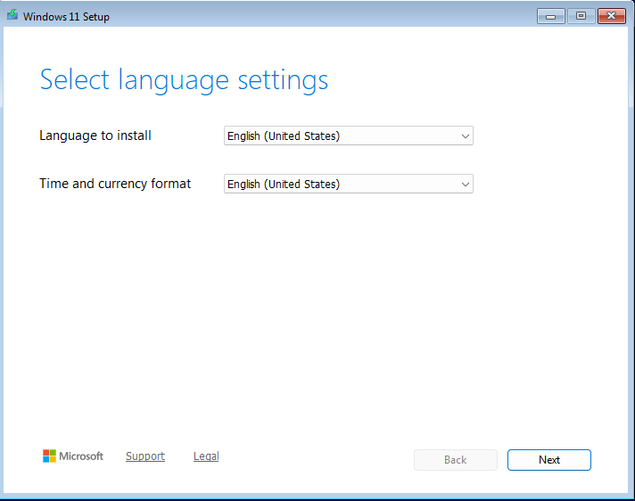
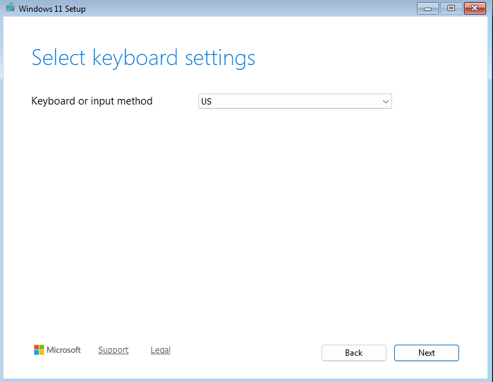
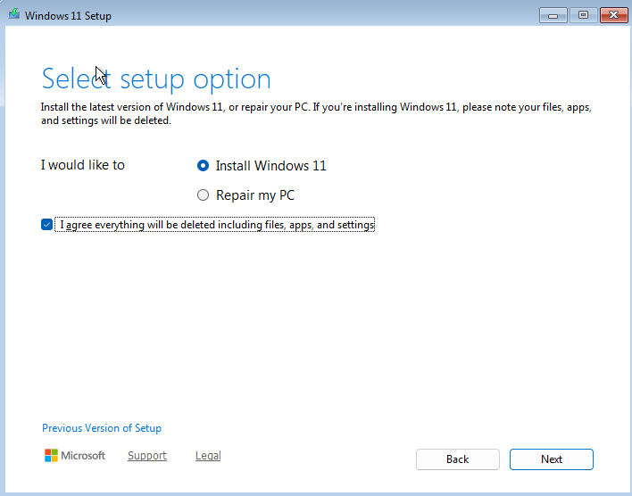
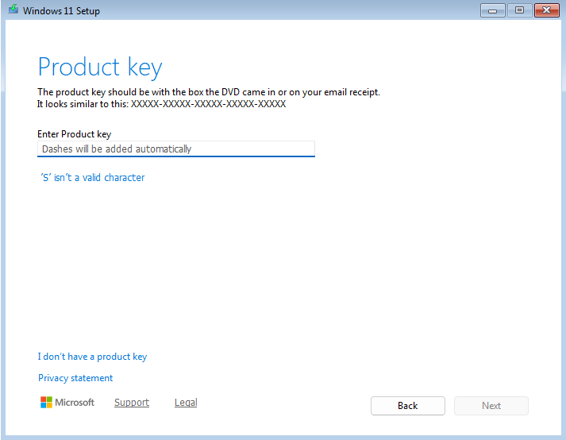
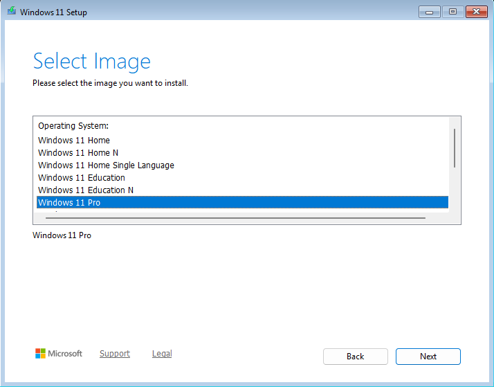
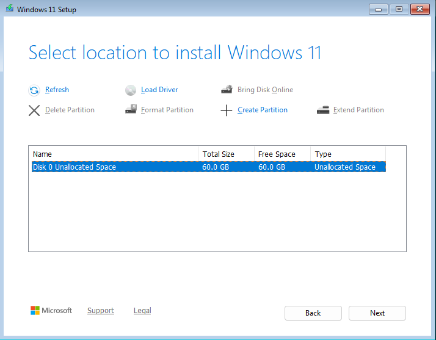
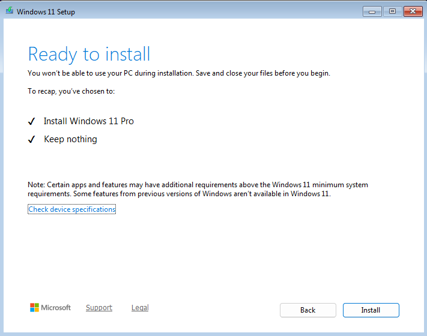
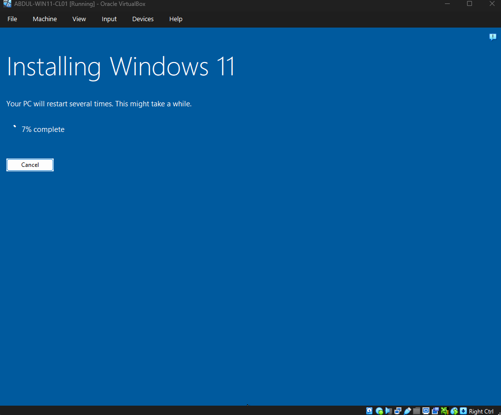
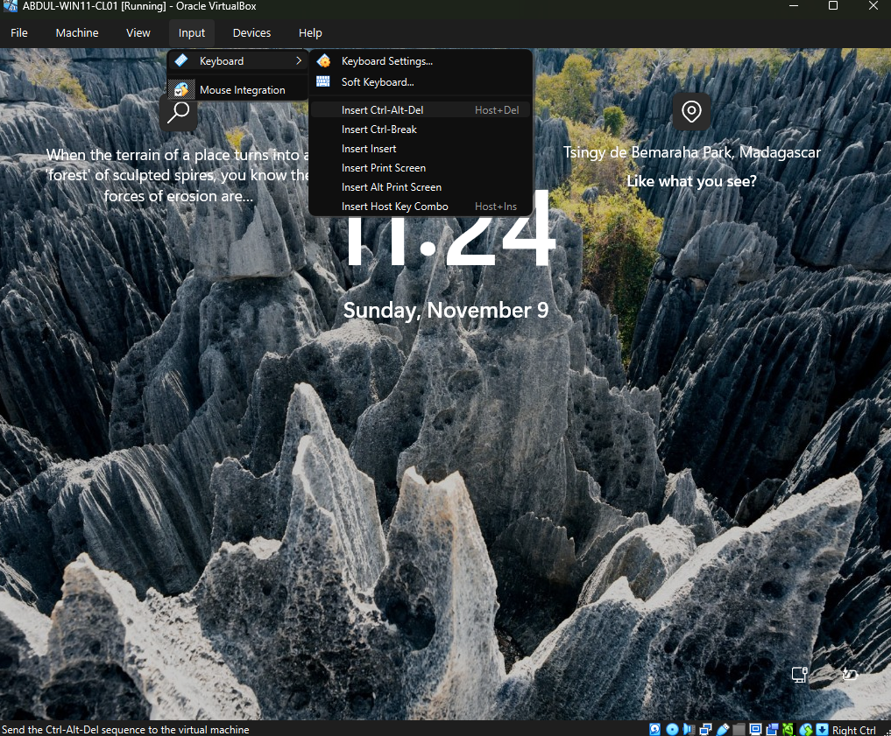

# Windows 11 Installation Lab

This project documents my hands-on lab installing **Windows 11 Pro** inside **Oracle VirtualBox**. I stepped through the full OS installation wizard: selecting language and keyboard settings, choosing the edition, partitioning the virtual disk, and confirming the final install.

## Objectives

- Boot from a Windows 11 ISO in a VirtualBox VM
- Configure language, time, currency and keyboard layout
- Choose the installation option (keep nothing vs. repair)
- Select the Windows 11 edition (Home vs Pro)
- Partition unallocated disk space for installation
- Verify readiness and begin installation

## Technologies Used

- **Oracle VirtualBox** (running on your host machine)
- **Windows 11 ISO**
- **Virtual Machine hardware**: 2 CPUs, 4 GB RAM, 60 GB disk (example)

## Skills Demonstrated

- Operating system installation and configuration
- Understanding virtualization vs. bare‑metal installs
- Disk partitioning within an OS installer
- Interacting with VirtualBox menus (e.g. sending Ctrl‑Alt‑Del)
- Choosing appropriate OS editions and license options

## What I Learned

- The difference between **Windows 11 Home**, **Pro**, **Education**, etc., and when to choose each.
- How to properly partition a virtual disk (create partition on unallocated space).
- Why product keys and licensing matter even in lab environments.
- That VirtualBox requires special key combinations (e.g. sending Ctrl‑Alt‑Del) to interact with the VM.
- How to follow an OS installer from language selection through to installation progress.

## Configuration Steps
Follow these steps to install Windows 11 Pro in Oracle VirtualBox:

### Step 1 – Boot from the Windows 11 ISO
Start your VirtualBox VM and boot from the Windows 11 ISO. This launches the Windows Setup wizard.

### Step 2 – Choose language, time & currency
On the **Select language settings** screen, pick English (United States) for both language and time/currency format, then click **Next**.

### Step 3 – Select keyboard layout
Choose the US keyboard layout (or your preferred input method) and click **Next**.

### Step 4 – Choose the setup option
On the setup option screen, select **Install Windows 11** (instead of *Repair my PC*) and tick the checkbox confirming that existing files will be deleted.

### Step 5 – Enter a product key or skip
If prompted for a product key, enter it or click **I don’t have a product key** to continue.

### Step 6 – Select the edition
From the list of Windows 11 editions, choose **Windows 11 Pro** (or your preferred edition) and click **Next**.

### Step 7 – Choose where to install
Select the unallocated virtual disk (e.g., 60 GB), create a partition if necessary, and click **Next**.

### Step 8 – Confirm and begin installation
On the **Ready to install** summary screen, review your selections (e.g., *Install Windows 11 Pro*, *Keep nothing*). When ready, click **Install** to begin.

### Step 9 – Monitor progress and finish
The installer will copy files and reboot several times. Wait for installation to complete. You’ll see a progress screen (around 7 % in this example) and eventually the Windows 11 lock screen.

  

